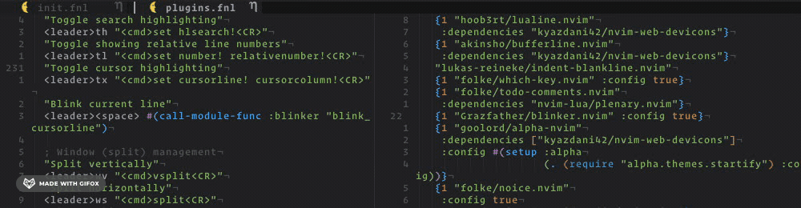

# blinker.nvim

__blinker.nvim__ is a dead simple nvim plugin that allows you to easily find your cursor.



## Installation
### lazy.nvim
```lua
{
  "Grazfather/blinker.nvim",
  config = true
}
```

### Packer
```lua
use({'Grazfather/blinker.nvim'})
```

## Setup
You must call `setup` for blinker to work, and then add bindings or hooks to
call `blink_cursorline`.

`blink_cursorline` takes optional `opts`, which, when provided, override the
values used in setup.

**NOTE**: The `color` opt cannot be overridden after setup.

```lua
require("blinker").setup({})

-- Bind it to a key to blink on demand
vim.api.nvim_set_keymap("n", "<leader><Space>", "<cmd>lua require('blinker').blink_cursorline()<CR>")

-- Bind it to another key to blink differently
vim.api.nvim_set_keymap("n", "<leader>x",
                        "<cmd>lua require('blinker').blink_cursorline({:count 5 :duration 50})<CR>")

-- Set it to blink on certain events
group = vim.api.nvim_create_augroup("BlinkSwitch", {clear = true})
vim.api.nvim_create_autocmd({"WinEnter"},
                            {pattern = "*",
                             callback = function()
                               require("blinker").blink_cursorline()
                             end,
                             group = group})
```

## Configuration
All configuration is done by passing an `opts` table to `setup`. The current
defaults are:

```lua
{
  -- How many blinks
  count = 2,

  -- Duration of each blink, in milliseconds
  duration = 100,

  -- Colour of the blink, if using the default highlight group
  color = "white",

  -- Highlight group to use, determining colour. If overidden, 'color' is
  -- ignored. Using a custom highlight group allows for finer-grained control
  -- of the highlight.
  highlight = "BlinkingLine",
}
```
